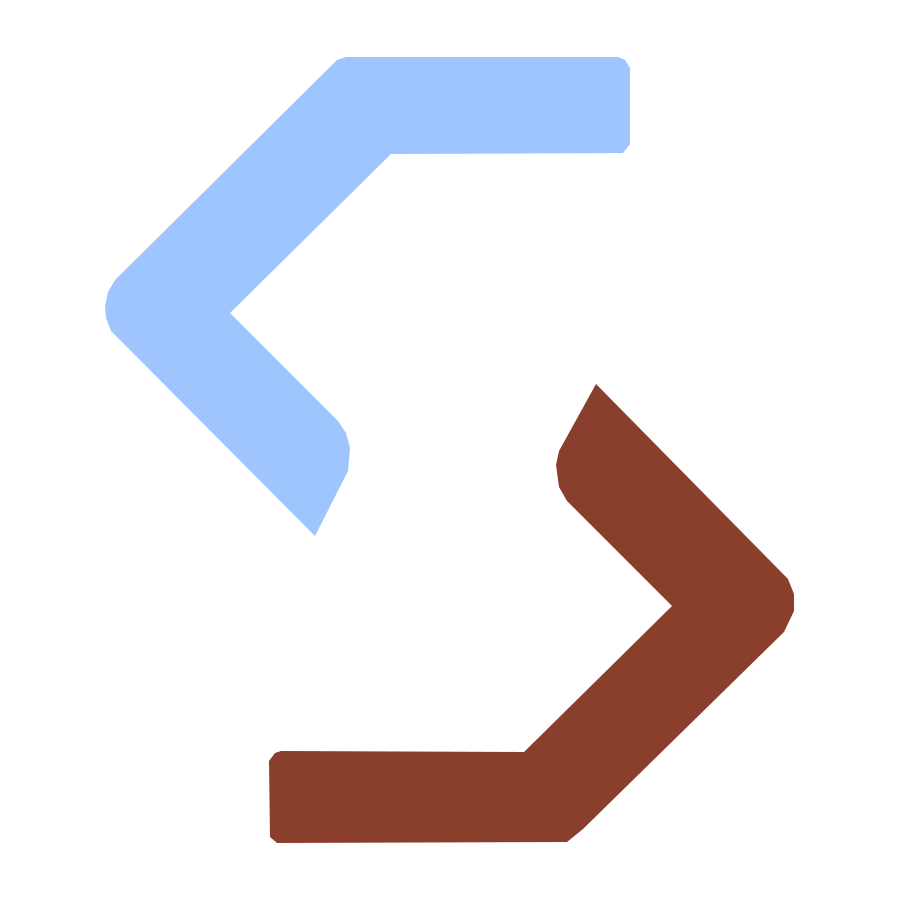

<p align="center">
  
</p>

# Snippet

Snippet is a small, dependency-free PHP 8.5+ publishing system for one author. It turns self-contained Markdown content directories into a completely static website. This repository contains the generator and its canonical defaults; the public example site lives separately under `demo/`.

Snippet provides:

- strict configuration, metadata, content, asset, and template validation;
- deterministic article, page, tag, and index routes;
- transactional publication that preserves the last valid `public/` on failure;
- a live-reloading local preview;
- editable semantic HTML templates, plain CSS, and light/dark themes; and
- no third-party runtime PHP packages.

## Why I created Snippet

I created Snippet because I wanted a publishing system that met my own needs without relying on a third-party tool. It was also a perfect opportunity to explore how AI can turn an idea into a working project. I did not write a single line of code myself; instead, I contributed ideas, suggestions, part of my knowledge, and the guidance needed to lead the agent through the project.

I have been working with AI for more than a year, and I believe now is the perfect time to use it as a partner. It makes it possible to build things that were previously out of reach outside our professional work—not because the ideas were missing, but because there was never enough time or more than two hands to do everything. It is also a great time to create more open-source projects driven by our own ideas and needs.

I mainly used GPT 5.6 Sol with medium and xhigh reasoning, and GPT 5.6 Luna with high and xhigh reasoning for smaller tasks. Sometimes I also used subchats in Codex, asking Luna to work within Sol's session and vice versa.

## Quick start

The primary workflow is a content-only repository powered by the official builder image. Start in an empty directory with the exact v2 release:

```bash
mkdir my-site
cd my-site

docker run --rm \
  --user "$(id -u):$(id -g)" \
  --volume "$PWD:/workspace" \
  ghcr.io/wanted80/snippet:v2.2.0 init # x-release-please-version
```

`--user` prevents root-owned output, while `--volume` exposes the current repository at the image's `/workspace` path. Edit the generated `site/config.php` and content, then rerun the command with `init` replaced by `validate` or `build`. Create later drafts through the same image, for example by replacing `init` with `new article first-post`.

The repository needs only `content/`, `site/`, and `resources/`; `public/` is disposable output. The builder image supports `--version`, `init`, `new page`, `new article`, `validate`, `build`, and `preview`. Run the local development preview from a content-only repository with an explicitly published loopback port:

```bash
docker run --rm --init \
  --read-only \
  --cap-drop ALL \
  --security-opt no-new-privileges \
  --pids-limit 64 \
  --cpus 2 \
  --user "$(id -u):$(id -g)" \
  --publish 127.0.0.1:8080:8080 \
  --volume "$PWD:/workspace" \
  --tmpfs /tmp:rw,noexec,nosuid,nodev,size=16m \
  ghcr.io/wanted80/snippet:v2.2.0 preview --host=0.0.0.0 --port=8080 # x-release-please-version
```

Preview is for local authoring only; production deployment still consists solely of the generated `public/` directory. See [INSTALL.md](INSTALL.md) for hardened raw-Docker and Compose preview examples, building another directory, direct PHP use, the contributor HTTPS preview, customization, CI, and deployment.

For a full checkout used to develop Snippet itself, Docker with Make remains the recommended environment:

```bash
git clone https://github.com/wanted80/snippet.git
cd snippet
cp .env.example .env
make demo-check
```

This builds the release image, assembles the demo in a temporary workspace, validates it, and proves the production build. [INSTALL.md](INSTALL.md) documents both official-image preview for content-only publications and direct preview from a full checkout.

## Content

Pages and articles occupy separate source collections. Each leaf directory is one content item, and its directory name is its URL slug:

```text
content/
├── pages/
│   └── <slug>/
│       ├── page.md
│       ├── meta.php
│       └── optional assets
└── articles/
    └── YYYY/MM/DD/<slug>/
        ├── article.md
        ├── meta.php
        └── optional assets
```

Article directories must use a real, zero-padded calendar date that matches the metadata date. The source hierarchy keeps archives manageable but does not change public URLs: articles use `/articles/<slug>/`, while pages use `/<slug>/`. The slugs `articles`, `assets`, `pages`, and `tags` are reserved.

Page and article directory slugs are author-chosen lowercase ASCII letters and numbers separated by single hyphens. Titles are independent and may use any language: a page titled `日本語`, for example, can use the directory slug `nihongo`. Snippet never transliterates a title automatically because pronunciation and convention are language-dependent.

Start a page or article with the minimal draft command in an initialized publication workspace:

```bash
snippet new page contact
snippet new article first-post
snippet new article older-note --date=2026-07-01
```

Content-only repositories use the equivalent builder-image command:

```bash
docker run --rm \
  --user "$(id -u):$(id -g)" \
  --volume "$PWD:/workspace" \
  ghcr.io/wanted80/snippet:v2.2.0 new article first-post # x-release-please-version
```

An article without `--date` uses the current UTC date. The command creates an empty Markdown file and a `meta.php` with empty title and description fields; articles also receive the selected date and an empty tag list. The result is intentionally incomplete, so finish both files before validating, building, or previewing. Draft creation checks that the relevant content collection is a regular non-symlink directory, does not validate the existing catalog or change `public/`, and never replaces an existing content directory. Run `snippet init` first when using an empty content-only workspace. Contributors can also run the canonical command after entering `make docker-shell`; there is deliberately no separate Make target.

Every `meta.php` starts with `declare(strict_types=1);` and returns one literal associative array. Article metadata has these required fields:

```php
<?php

declare(strict_types=1);

return [
    'title' => 'Example article',
    'description' => 'A short description used by indexes and metadata.',
    'date' => '2026-08-02',
    'tags' => [
        'PHP 8.5',
        'Writing',
    ],
];
```

Articles may opt into one cover stored at the root of the same article directory:

```php
'cover' => true,
'alt' => 'A descriptive text alternative.',
```

`cover` is optional and defaults to `false`. When it is `true`, exactly one file named `cover.jpg`, `cover.png`, or `cover.webp` must exist directly in the article directory. The builder detects the format, requires it to match the filename, and derives the intrinsic dimensions for the generated markup. A missing, corrupt, mismatched, or ambiguous cover fails validation.

`alt` is optional and may be used only with an enabled cover. When present it must be trimmed non-empty text within the description-length limit; when omitted the generated image uses `alt=""`. Pages reject `cover` and `alt`, and Markdown image syntax remains unsupported.

The original cover bytes are copied unchanged. The figure appears only on the canonical article page and when that article is featured in full on the homepage; archive cards and tag pages omit it. `.article-figure` is the stable styling hook, and `resources/templates/article-figure.html` owns its semantic markup.

Page metadata requires only `title` and `description`. It may also define a positive, site-unique `menu_order` to enter the primary navigation:

```php
<?php

declare(strict_types=1);

return [
    'title' => 'About',
    'description' => 'About this site.',
    'menu_order' => 1,
];
```

No more than four pages may define `menu_order` under the internal navigation ceiling. Every page appears at `/pages/` whether or not it is in the direct navigation.

The demo keeps `demo/content/pages/about/` as a conventional permanent About page and promotes it with `menu_order`. It remains an ordinary page; initialized publications start with empty page and article collections and do not require any particular page slug.

Tags retain their source order. Their route slugs are generated deterministically by lowercasing UTF-8 labels, replacing runs of characters other than Unicode letters, combining marks, and numbers with one hyphen, and trimming edge hyphens. `PHP 8.5` becomes `php-8-5`, `Café` becomes `café`, and `日本語` remains `日本語`. A generated slug must be non-empty and unique within an article, and it must map to one consistent display label throughout the catalog. Tag slugs and output-directory names remain Unicode—for example, `public/tags/café/`—while every emitted slug is UTF-8 percent-encoded as one RFC 3986 path segment, producing the ASCII-safe URL `/tags/caf%C3%A9/`.

Assets placed beside `page.md` or `article.md` are copied beside that item's generated `index.html`, with relative paths preserved. Symlinks and paths whose first component is `index.html` are rejected.

### Markdown

The supported Markdown subset is:

- paragraphs separated by blank lines;
- level 1–3 ATX headings, with the first authored heading at level one and no skipped levels;
- unordered lists using `-` or `*`;
- ordered lists using numeric markers such as `1.`;
- fenced code blocks using triple backticks, with an optional language;
- inline code;
- emphasis, strong emphasis, and strikethrough;
- links with safe HTTP(S), root-relative, or relative targets; and
- thematic breaks.

Raw HTML, images, tables, nested lists, HTML-style attributes, and arbitrary extensions are not supported. Link labels must not be blank. Text, labels, URLs, and code are escaped so authored content cannot become executable markup.

Validation checks every internal Markdown link against the complete generated route and copied-asset inventory. Authored root-relative links are portable site links: `/about/` renders beneath the configured deployment path, such as `/snippet/about/`. Item-relative links remain relative to their content route. Absolute HTTP(S) links on the configured origin are checked only when they are beneath the configured deployment path; same-origin links outside that path and external HTTP(S) links are outside this publication and are left unchecked. Resolution removes query strings and fragments, percent-decodes each path segment, normalizes `.` and `..`, and percent-encodes the normalized segments again before inventory matching. Raw `/tags/café/` and encoded `/tags/caf%C3%A9/` references are therefore equivalent. Encoded dot segments such as `%2e` and `%2e%2e` receive the same traversal checks, including rejection above the site root. Canonical directory routes and explicit generated `index.html` paths are accepted; errors identify the Markdown file and line. Fragment identifiers themselves are not checked.

## Site customization

`resources/` contains the canonical builder-shipped templates, stylesheet, theme script, and preview support. Root `site/` contains the generic configuration and customizable site assets copied by `snippet init`. The public example combines those shared inputs with `demo/content/` and the single demo-specific override at `demo/site/config.php`; no duplicate starter tree is committed.

## Repository and demo separation

The root is the generator and reference implementation. `site/` and `resources/` are the one maintained source for initialized publications, while `demo/content/` preserves the project website's articles and pages. `snippet init` creates empty `content/articles/` and `content/pages/` collections and copies only the generic root defaults—never demo configuration or content. CI composes the demo into a temporary normal workspace, validates it, builds it, and deploys only the generated output.

Container support is grouped by responsibility under `docker/`: `development/` owns the contributor image, `builder/` the published minimal image, `demo/` temporary demo composition, `preview/` local Caddy support, and `quality/` container-specific quality tooling. Shell sources retain their `.sh` extension in the repository even when an image installs them as an extensionless command.

`site/config.php` defines the site's identity and build preferences with one exact shape:

```php
<?php

declare(strict_types=1);

return [
    'title' => 'Snippet',
    'sitename' => 'Snippet',
    'author' => 'Your Name',
    'description' => 'A personal collection of articles.',
    'url' => 'https://example.com/snippet',
    'language' => 'en',
    'home' => [
        'articles' => 10,
        'tags' => 21,
    ],
    'build' => [
        'minify' => false,
    ],
];
```

The URL must be the final HTTPS site URL, including any deployment path, without credentials, a query, fragment, or trailing slash; it supplies every canonical URL. Root hosting such as `https://example.com` and project hosting such as `https://example.com/snippet` are both supported. Path segments must be well formed and percent-encoded when necessary. Homepage counts are positive integers. The homepage renders the newest article in full, then up to the configured number of older articles and popular tags. Conditional links lead to complete indexes when either collection is truncated.

The `language` value sets the document's HTML language tag. The shipped templates contain English interface text and English-formatted publication dates; translate those editable templates when using another language tag.

`title` is the document identity used in browser titles, descriptions, and the homepage's hidden heading. The required `sitename` is independent trimmed, non-empty UTF-8 text used by the centered wordmark and its “— Home” accessible label. The required `author` is also trimmed, non-empty UTF-8 text and supplies the document's author metadata; every document identifies its running Snippet version as the generator. The starter theme displays the site name in uppercase with the bundled Snippet Logo font; the stored and accessible text is unchanged, and unsupported glyphs fall back to the interface font.

When `build.minify` is enabled, publication conservatively collapses whitespace-only text nodes between HTML tags. It leaves prose, attributes, comments, doctypes, inline spacing, and the contents of `pre`, `code`, `textarea`, `script`, and `style` unchanged. It also stream-minifies required `resources/theme.css` and optional `site/site.css`: external whitespace is collapsed, whitespace around `{`, `}`, `;`, and `,` is removed, and strings, escapes, comments, and meaningful token spacing are preserved. Malformed or uncertain CSS is copied unchanged. When minification is disabled, both stylesheets use the direct byte-for-byte copy path. `resources/theme.js`, optional `site/site.js`, content assets, and files beneath `site/assets/` remain byte-for-byte copies in either mode.

### Site assets

`site/favicon.svg` is the required default browser icon and is copied unchanged to `/favicon.svg`. Replace that file with any valid SVG to customize the site's favicon; a square canvas is recommended for consistent browser presentation. The generated layout references it at the configured deployment path.

Every regular file under `site/assets/` is copied to `/assets/site/` with its relative path preserved. Use this directory for icons, self-hosted fonts, and other site-owned presentation assets; symlinks are rejected.

### Templates and theme

The 13 editable HTML files under `resources/templates/` own the author-customizable structural markup. `layout.html` provides the document shell, metadata, header, navigation, main region, and footer; the remaining files define the homepage, not-found page, shared collection and content structures, and repeated items. Small engine-owned fragments remain in PHP when they serialize typed data or depend on validated runtime state: Markdown HTML, social and robots metadata, date markup, navigation links, resource hints, conditional stylesheet and script tags, empty states, and optional index links. This keeps loops and conditionals out of the template language without creating one-off fragment templates.

Templates use named placeholders such as `{{body}}`, `{{title}}`, and `{{items}}`. Surrounding HTML, classes, and text may change, and placeholders may move or repeat, but every placeholder expected by a template must remain and unknown or malformed placeholders are rejected before publication. Placeholder values are either escaped text or trusted HTML produced by the engine or another validated template, so keep them in their intended text or attribute contexts rather than moving them into JavaScript or CSS. The layout's `{{author}}` placeholder supplies author metadata, `{{version}}` supplies the release-managed generator version, `{{base_path}}` prefixes template-owned root links, and the repeatable `{{sitename}}` placeholder supplies both wordmark text and its accessible home label. `{{social_metadata}}` emits engine-owned Open Graph and Twitter/X metadata together with the not-found page's `noindex` directive. `{{theme_script}}` and `{{theme_stylesheet}}` emit the fingerprinted built-in asset tags. Layouts initialized by an earlier v2 release may still contain the exact released stable theme `<script>` and `<link>` tags; Snippet transparently normalizes only those two tags to the fingerprinted placeholders during validation. Modified, malformed, or incomplete legacy tags remain invalid so template mistakes are not silently accepted. `{{preloads}}` belongs before `{{theme_stylesheet}}`, `{{site_stylesheet}}` follows it, and `{{site_script}}` follows `{{theme_script}}`. Each optional site placeholder renders an empty string when its validated asset is absent. The wordmark links home; the adjacent native popover contains Articles, Tags, Pages, ordered `menu_order` pages, and a final `llms.txt` link without widening the header.

The default theme follows the visitor's system light or dark preference until the menu's theme action is used. That choice is stored under `snippet-theme` and synchronized across open same-origin tabs when browser storage is available. The behavior lives in `resources/theme.js`, is copied unchanged to a fingerprinted `/assets/theme.<xxh3>.js` filename, and is permitted by the generated same-origin Content Security Policy without `unsafe-inline`.

The builder publishes required `resources/theme.css` as `/assets/theme.<xxh3>.css`, then loads optional UTF-8 `site/site.css` from `/assets/site.<xxh3>.css`. Optional UTF-8 `site/site.js` is copied byte-for-byte to `/assets/site.<xxh3>.js` and loaded with `defer` after `/assets/theme.<xxh3>.js`. Each `<xxh3>` token is the complete 16-character lowercase digest of the exact published bytes, after optional CSS minification. Absent optional files produce neither tags nor output. Files beneath `site/assets/`, the favicon, and content assets retain their stable paths. Put downstream CSS rules in the final layer:

```css
@layer overrides {
    :root {
        --font-reading: "My Font", serif;
    }
}
```

The starter site self-hosts the upright and italic variable webfonts for [Atkinson Hyperlegible Next](https://www.brailleinstitute.org/freefont/) for reading and interface text, plus the supplied Snippet Logo WOFF2 for the wordmark. The upright interface and wordmark fonts are each preloaded only when both `site/site.css` and the matching asset are present; the italic interface font remains demand-loaded. These known paths provide an optional preload optimization in the renderer; they do not constrain replacement fonts or require configurable preload machinery. The Atkinson files come from the [official font repository at commit `7925f50`](https://github.com/googlefonts/atkinson-hyperlegible-next/tree/7925f50f649b3813257faf2f4c0b381011f434f1) and are distributed under the SIL Open Font License 1.1 included beside them. No font-service request is made. Remove `site/site.css` to return all three stable font tokens to their system fallbacks, or replace its `@font-face` declarations and files beneath `site/assets/fonts/` to self-host other families.

Every route keeps its canonical link and receives Open Graph and Twitter/X title, description, URL, and site-name metadata. Articles use `og:type=article`; other routes use `website`. A covered article also emits its validated absolute image URL, MIME type, dimensions, and non-empty authored alt text, and uses the large-image card. No site-wide social image or additional social configuration is implied.

### Stable CSS API

Stable color tokens are `--color-background`, `--color-surface`, `--color-interactive`, `--color-text`, `--color-muted`, `--color-accent`, and `--color-border`. Stable font tokens are `--font-reading`, `--font-interface`, `--font-wordmark`, and `--font-code`. Stable sizing tokens are `--measure-prose`, `--measure-shell`, `--space-1` through `--space-6`, and `--space-section`.

Stable hooks are `.site-header`, `.site-brand`, `.site-wordmark`, `.site-navigation`, `.site-main`, `.article-list`, `.article-figure`, `.content-header`, `.prose`, `.tag-list`, and `.site-footer`. CSS layers are ordered `reset`, `tokens`, `base`, `layout`, `components`, `overrides`. Other DOM details may evolve; changing a stable token or hook requires a migration note.

### Resource limits

Snippet applies generous internal ceilings to catalog counts, text and file sizes, Markdown complexity, image dimensions, assets, templates, rendered pages, and total output. They protect the builder from pathological input and are tested as implementation boundaries; authors do not configure them, and no limit setup is required.

Configuration and metadata files are declarative PHP rather than executed code. They may contain only `declare(strict_types=1);` and one returned literal array. Calls, expressions, variables, interpolation, includes, duplicate keys, and output are rejected.

## Output and architecture

`bin/snippet build` loads one shared publication-input snapshot and validates its configuration, content catalog, article images, Markdown references, assets, and templates before rendering. `validate`, `build`, and every preview rebuild use this identical boundary. It writes a unique temporary sibling tree and replaces `public/` only after every page and asset succeeds. The generated routes are:

- `/index.html`, containing the homepage;
- `/404.html`, containing the shared-layout not-found document used by compatible static hosts;
- `/articles/index.html`, `/pages/index.html`, and `/tags/index.html`;
- `/articles/<slug>/index.html` for each article;
- `/<slug>/index.html` for each page;
- `/tags/<tag-slug>/index.html` for each tag;
- `/llms.txt`, containing the metadata-only language-model index; and
- generated and copied assets beneath `/assets/` or beside their content item.

`/llms.txt` has this exact shape, with each collection heading and its list omitted when that collection is empty:

```text
# <site title>

> <site description>

Author: <author>

## Articles

- [<article title>](<absolute canonical URL>): <description> (Published: YYYY-MM-DD)

## Pages

- [<page title>](<absolute canonical URL>): <description>
```

Its metadata is collapsed to single lines and Markdown-escaped so authored values cannot add structure. Article links are newest-first, page links use the existing title/slug order, and URLs are absolute. Markdown bodies, tags, archives, and copied assets are deliberately not duplicated in this file.

Articles are ordered by date descending and then slug ascending. Pages are ordered by title and then slug. Tags on indexes are ordered by article count descending, then label and slug ascending. Builds do not depend on filesystem traversal order or ambient process state.

Markdown inline, list-item, and link traversals, together with preview filesystem fingerprint records, are exposed internally as fresh, forward-only generators. This reduces transient allocations for one-pass consumers. The validated catalog remains materialized because ordering, complete route inventory, tag aggregation, reference validation, and snapshot-safe transactional publication all require one shared complete snapshot; generators do not replace it.

Runtime code uses only PHP's standard library. Composer supplies the PHP platform requirement, PSR-4 autoloading, project scripts, and approved development-only quality tools. The selected static host owns upload configuration, public HTTPS, and certificates; only the generated `public/` directory is deployable. This repository builds `public/` through the locked production Docker workflow and deploys that artifact to GitHub Pages only when a stable GitHub release is published, checking out the released tag rather than mutable branch state. Pull requests, pushes, manual quality runs, and prereleases never deploy; generated output remains ignored, and no publication branch is used.

The root-level `/404.html` uses the same layout, navigation, theme, optional site assets, configured deployment path, and minification policy as every other document. GitHub Pages and static hosts with the same convention serve it for missing routes with a 404 response. Snippet preview mirrors that behavior beneath the configured deployment path and still injects live reload only into the served response.

The default layout also carries a restrictive meta Content Security Policy for same-origin scripts, styles, images, fonts, and connections. Browsers do not enforce `frame-ancestors` from a meta policy, so configure the static host to send `Content-Security-Policy: frame-ancestors 'none'` as an HTTP response header. `X-Content-Type-Options: nosniff` and `Referrer-Policy: strict-origin-when-cross-origin` are sensible companion headers. Docker's local Caddy preview sends these headers, but deployment configuration belongs to the selected host. GitHub Pages does not provide project-controlled response headers, so its deployment retains the meta CSP but cannot add all of these recommended response headers.

## Maintenance and releases

Pull requests run the complete Docker development gate, validate both Compose environments, audit the locked Composer dependencies, exercise preview through the release builder image, report fixed high and critical operating-system vulnerabilities in that image, and validate and build the composed demo. Run the same project-owned checks locally with:

```bash
make docker-check
make demo-check
make docker-audit
```

`docker-check` is deterministic and includes exact line and type coverage, Pint, Rector, PHPStan, content validation, ShellCheck, and JavaScript syntax validation. The resource-intensive `docker-mutations` target separately runs the complete Pest suite against every covered source class and requires a 100% mutation score. `docker-audit` is separate because the Composer advisory lookup requires network access.

Snippet follows Semantic Versioning. Pull requests are squash-merged with conventional titles, and Release Please maintains `CHANGELOG.md`, `vX.Y.Z` tags, and GitHub releases. Each stable release also publishes the official multi-platform builder image to GitHub Container Registry with maximum BuildKit provenance, an SPDX SBOM, and GitHub build provenance; the release workflow records its immutable digest. See [CONTRIBUTING.md](CONTRIBUTING.md) for title conventions and the full contributor workflow. Report vulnerabilities privately and verify builder releases as described in [SECURITY.md](SECURITY.md).

## Documentation

- [Installation and operation](INSTALL.md)
- [Contributing](CONTRIBUTING.md)
- [Security policy](SECURITY.md)
- [Contributor and coding guidance](AGENTS.md)
- [MIT license](LICENSE)
- [`demo/`](demo/) for the public example site's content and configuration override
- [`site/`](site/) for generic initialized-site configuration, fonts, and assets
- [`resources/`](resources/) for canonical shared publication defaults and preview support
- [`src/`](src/) for the dependency-free builder

Snippet source is available under the [MIT License](LICENSE). The bundled Atkinson Hyperlegible Next font files retain their separate [SIL Open Font License 1.1](site/assets/fonts/atkinson-hyperlegible-next/OFL.txt).
